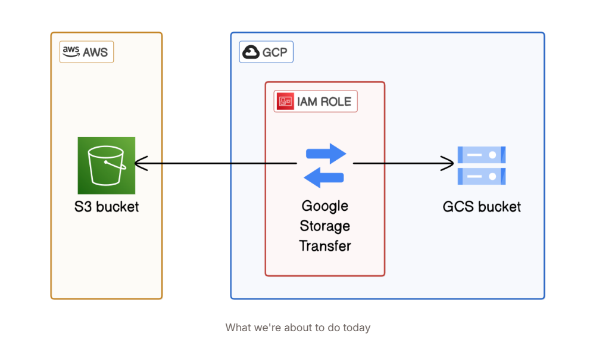

# 🌐 Multi-Cloud Data Transfer with AWS and GCP

This project demonstrates seamless data transfer between Amazon Web Services (AWS) and Google Cloud Platform (GCP) using native cloud services. The solution ensures secure, scalable, and reliable movement of data between Amazon S3 and Google Cloud Storage.

## 🚀 Overview

The goal of this project is to automate and streamline the transfer of data stored in AWS S3 buckets to Google Cloud Storage buckets, using GCP's Storage Transfer Service and AWS tools. This is especially useful for hybrid or multi-cloud strategies.

## 🛠️ Technologies Used

### Amazon Web Services (AWS)
- **Amazon S3**: Source cloud storage for objects to be transferred.
- **AWS IAM**: Managed secure permissions and access to S3 buckets.
- **Amazon SQS**: Used for managing notifications or queue-based communication.

### Google Cloud Platform (GCP)
- **GCP Cloud Storage**: Target cloud storage for receiving transferred data.
- **Storage Transfer Service**: Facilitated the actual transfer process from AWS S3 to GCP Cloud Storage using service accounts and configuration files.

## 🧰 Features

- ✅ Automated data transfer setup
- ✅ Secure cross-cloud authentication using IAM roles and service accounts
- ✅ Scalable architecture using cloud-native services

